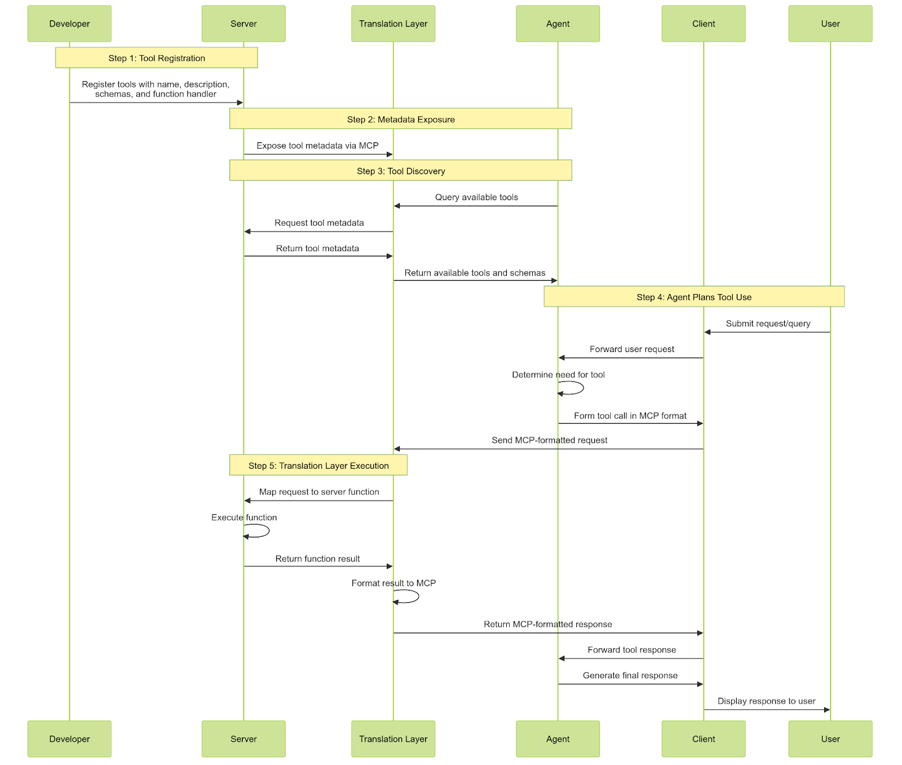

## MCP Video notes. 

Like REST APIs for AI

Prompt -> LLM -> Response

Problem: How do We take works from LLMs and take action (tools)

**Rag** 

Need to connect a foundation model into a data which it can access

- Tools
- Resources
- 

Building an agent

1. Server Regisers tools. 
2. Server Exposes Metadata
3. Agent Discovers Tools: Agent queries server via MCP to see what tools are available. Tool metadata tells agents how to use tools.
4. Agent Plangs Tool Use: Forms a tool call in MCP JSON format which has tool name, input param, and other metadata.
5. Translation Layer Executes: takes agents standardized tool call, maps the function on the server, executes function, formats results in MCP and sends back to agent. 

- Agent: "brains" powered by LLM, decides which tools to call in order to complete task. If a platform or agent does not support MCP natively, is up to developer to figure out how to translate logic and parse metadata from an AI reponse to valid protocol query. LLMs can do this. 
- Host app (Agent): Where the LLMs actually run
    - Client: sends tool call requests from the agent. Passes tool call requests to server using MCP. Create an instance of a client via MCP library. 
- Server: Either external or internal
    - Tools
    - Resources
    - Prompts
    - Capabilities. 

    - Composable servers
        - Extra mcp servers which servers can act as a client for.

Connection:
- stdio, pipes (not looking for)
- HTTP/SSE (JSON/RPC)

What does MCP actually do? 
Host all tools, resources etc on a server which can be re-used. 

Prompt -> Read MCP capabilities -> Gain corresponding data. -> 
Pass #1
Decide on resources.
Pass #2
Proccess recources resources.

LLMs wont actually call any code, they will recommend actions to take. 

## **AI Agents are just microservices**
**AI Agents** 

