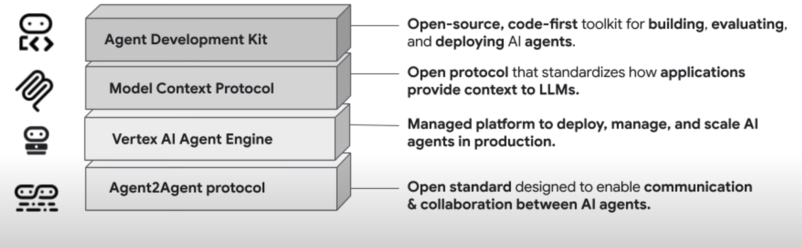

# Team Needs
In order to adopt an ADK system people on the team will need to adopt some of these key skills
- Python and software development basics: (Minimal python knowledge is required in order to write agent prompts.)
- Command line basics (to set up adk testing servers)
- Google cloud console and ADK deployment.
- Basic JSON knowledge (to write agent cards.)
- Documentation understanding
- Understanding of web for A2A servers.
- Understanding of websocket and live audio streaming for gemini live implementations.

**Study guide for ADK & A2A python**
*Prompt developer*
- Elementary python (Variables, math, print logging, etc.)
- Basics of functions
- Docstrings
- Basics of python dictionaries. (dictionaries are very similar to JSON objects.)
- Python module interaction
*Agent Orchestration developer*
- Asyncronous functions & Asyncio
- Basics of python classes. (Classes are templates for objects, objects are groupings of function and variable data.)
- Intermediate classes knowledge, inheritance, writing classes, factory methods.

# Agent Development Kit (ADK)
*Google’s Toolkit for Building AI Assistants*

**Docs**
- https://google.github.io/adk-docs/
- https://github.com/google/adk-samples

## About ADK
ADK or App Development Kit is agentic chatbot framework made by google.
ADK consists of an SDK which helps developers designed and deploy AI Agents. Currently ADK is best supported in python. ADK also has java bindings.

ADK is …
- Model Agnostic
- Deployment Agnotic
- Interoperable with other technolgy

With recent innovations ADK is beginning to add support for live voice via the **Gemini Live** API

ADK examples can be found in the agent garden in GCP.

## Tools & Capabilities in the ADK SDK
The ADK sdk contains a library for development as well as a pre-built web front-end to quickly test & ADK bot interaction.

**Capabilities:**
- Define core behaviour and logic via agent instructions (similar to playbooks)
- Manage agent lifecycles, state, and memory. ADK offers short term session state memory and long term knowledge options)
- Integrate built ADK agent with tools. (These can be python functions or a variety of built in tools offered by google.)
- Integrate agents with data. ADK has some built in functions to deal with MCP.
- Orchestrate multi-agent workflows. (agent teams) ADK can create sequential, loop and parallel agent execution.
- Safety Input and too argumetn guardrails with before_model_callback and before_tool_callback
    Both of these are really simple callback functions which are supplied tool calling context or response context to filter out responses which the team would like to avoid. ADK wil look for an additional optional response for each failed sanitization check.
    While by default this approach favors regex, using an additional llm with the google.genai library could also work very well.

In order to use arbitrary models along with gemini, ADK utilizes the LiteLLM library.

Agents can act as powerful reasoning skill agents or determenistic routing agents depending on the context. Determenistic agents are called workflow agents.

### Key Ideas
- Session management: 
    - Context is the session
    - History is a log of chat events
    - State represents agents working memory
- Events: 
    - Basic units of data representing conversation flow. (reply, user messaged, tool use) Together events will form the conversation history.
- Tools:
    - Tools can be either python functions or tools built into ADK by google. 
    - AIs have the option to use google search without any extra setup which is a powerful way to easily make more accurate responses. 
    - Documentation strings are essential to creating a tool in ADK. The bots will be reading these strings in order to determine how to interface with them.
- Callbacks:
    - Functions which can be called before or after a agent, model interation, or tool use. These callbacks are given the agent context and can be used for logging and sanitization. 

### Important Data Types, Classes and Functions
- Callbacks: custom code snippets written into points in the agents process allowing for checks, logging or behavior modifications. set the callback in agent initialization, -> before_model_callback=block_keyword_guardrail
- Grounding: ADK agents can be "Grounded" by using google search as a tool. 
- Memory: Memory is different from state. Allows agents to recall information across multiple sessions.
    - SessionService: Responsible for managing conversation history and state for different users and sessions. 
    - The InMemorySessionService is a simple implementation that stores everything in memory, suitable for testing and simple applications. It keeps track of the messages exchanged. 
    - Session state: Tied to a specific user session. Persists information across multiple conversational turns within that session. 
    - Agents are able to insert data into the session state with the output key parameter. Agents have access to elements of the session state by putting the state data name in curly brackets.
- Artifact managment: There are classes desinged to allow agents to handle files or binary data.
    - ToolContext: Provides the context for a tool invocation, provides access to the invocation context, function call ID, event actions, and authentication response. Provides memory retrieval methods and methods for listing artifacts.
- Runner: This data class is responsible for handling all execution flow, orchestrates agent interactions based on events and coordinates with backend services. 
- Agent: Agent class is a label for the llm class. There are llm agents and workflow agents.
    - LlmAgent: This class is the most essential class for quickly creating agents. Every ADK package should have a root_agent object exposed for the ADK SDK and front end tools to use. 
    - Sequential Agent: Agent class which will execute sub agents in order. Useful for determenistic steps where tasks need to be completed in order. 
    - Loop Agent: This is a specialized agent class which runs sequential agents until a specific condition is met. 
    - Parallel Agent: Runs agents asyncronously. If the output of agent work is data, a merger agent might be necessary.
    - Custom Agents: ADK allows users to inherit from the BaseAgent class in order to create agents with more complex state managment or determenistic flows. 
        Overriding the _run_async_impl method is the primary way of defining behavior on agent invocation.
        The heart of any custom agent is the _run_async_impl method. This is where you define its unique behavior.
    - Driving classes: You can create a class whith a has a relationship with many agents and handles orchestration.       
        Making custom classes or inheriting BaseAgent is very useful to handle complex things like A2A interaction. 

### Agent Deployment
Deploying to cloud is essential to building the agent. Google offers many different options Vertex AI comes with an sdk to help with CI/CD configurations. 
Agents are accesible through a specialized agent engine UI 

https://google.github.io/adk-docs/deploy/agent-engine/

# Agent to Agent Protocol (A2A)
*The Universal Language for AI Collaboration*

**Docs**
- https://github.com/a2aproject/A2A/blob/main/docs/tutorials/python/1-introduction.md
- https://github.com/a2aproject/a2a-samples

## About A2A
While Originally Owned by google, Ownership of the A2A protocol has moved over to the linux foundation who is committed to keeping this technology open source. 

A2A is an Open standard, common language for AI agent communication and collaboration.
A2A works with tools such as:
- Google ADK
- LangGraph
- CrewAI
- Genkit

At a high level A2A is used to:
- Offer direct, standardized communication and collaboration between different AI agents, even if they are running as separate services or on different machines.
- Agents to discover each other's capabilities (via Agent Cards) and delegate tasks. This is crucial for our Orchestrator agent to interact with the specialized Planner, Social, and Platform agents.
- Form a network of collaborating asynchronous AI agents. 

**From the blog:**
- A2A is built on existing standards (HTTP, SSE, JSON-RPC)
- Complements the MCP protocol which is made by Anthropic
- Very new Tech, may face issues on the bleeding edge.
- Google has partnered with over 50 businesses one of them being accenture. Ths means that there is almost certainly someone in KX who is an expert on the topic.
*Scott Alfieri, Is specifically quoted in the announcement blog. He is an AGBG global lead*

## A2A deeper dive

**A2A Facilitates the interaction between 3 key parties:**
- End User: A human
- Client Agent: Responsible for creating requests and handling end user actions. As client agent you:
    - Fetch and understand agent cards. 
    - Send messages
    - Process responses. 
    - Handle & Manage Task IDs for Tasks which take time and ping for Task completion.
- Remote Agent: Responsible for acting on requests made, take correct action. As a server/remote agent you:  
    - Host agent cards with skills and capability info
    - Handle Incoming agent requests and execute them via agentExecutor.

**Main Capabilities of A2A** 
1. Agent Discovery:
    - Before an A2A can do anything on the protocol it first needs to define what is can do and how other agents would interact with its capabilities.
    - Agents can advertise their capabilities using an "Agent Card" in JSON format, allowing the client agent to identify the best agent for a task.
    - Agent cards act as a robots.txt to help classify and index agents available on an A2A network.
    - This means clients know when and how to utilize agents
2. UX Negotiation:
    - Clients and agents will agree on communication methods.
    - The client and remote agent to negotiate the proper format and user interface capabilities.
3. Task Management:
    - Clients and agents have mechanisms to communicate task status, changes and dependencies throughout task execution.
    - The "Task" object is defined by the protocol and has a lifecycle.
4. Collaboration:
    - Agents can send messages to each other to convey context, responses, artifacts, or user instructions.
    - Dynamic interactions.
    - Agents request clarifications from the end user as well

**A2A Agent interaction pipeline:**
	End-User -> Client -> Client Agent -> Agent Mesh
Interaction Timeline:
1. Agent discovery: Client Agent will search remote agent to find capabilities thru agent.json file
2. Interactions: Bots will send JSON RPC messages to each other over https. Inside are A2A Objects:
	a. Messages, One turn in the operation. 
		i. Roles (user/agent)
		ii. Parts (text, file or JSON)
	b. Agent Executor. Class which links the protocol plumbing to agent logic.
	c. Task Objects: 
		i. Contains ID and status
		ii. Client agent can call tasks get function to query task completion status
		iii. Eventually returns task as completed with summary in task.artifacts
3. Streaming: Server agent can push updates to a task as they happen instead relying on polling and sending all in one once done.


### Important Classes, Data Types, and functions
**Agent Skills:** (Can be created as python classes)
Describes a specific capability or function which the agent can perform. 
- Id: skill identifier
- Name: human readable name
- Description: A detailed explanation of what the skill does
- Tags: keywords for categorization & discovery
- Examples: Sample use cases & prompts
- I/O Modes: Supported Media for I/O (text, or JSON, etc.)

**Agent Card:** (Can be created as python classes, or JSON classes)
JSON document which A2A server makes publicly available, usually stored at .well-known/agent.json (analagous to robots.txt or business card)
Agent cards are a crucial part of creating an agent network. 
- Name, Description, Version: Basic Identity Info
- Url: Endpoint where the A2A service can be reached
- Capabilities: Specified supported A2A features (streaming, pushnotifications etc.)
- Default I/O modes: Default Media types for agent
- Skills: list of the AgentSkill objects outline earlier. 

**Agent Executor:**
Core logic of how A2A agents process requests & generate responses. The A2A sdk provides the abstract class ```a2a.server.agent_execution.AgentExecutor``` to implement
Links the A2A protocol plumbing together. (A2A SDK & logic of our agent)
SDK will handle http, json rpc & event management. 
The AgentExecutor executor class has two main methods:
-  Execute(self, contecxt: RequestContext, event_queue: EventQueue) Handles requests which expect a response or an even stream. Users input is contents, and event queue is used to send back data objects. 
-  Cancel(self, context: RequestContext, event_queue: EventQueue): Handles requests to cancle running tasks. 
Event queues are objects which queue up data to be sent

**Task Object:**
Job which an agent needs to do. Has an ID and a status on the progress for every task. 
An agent can periodically call tasks get in order to get the task status of another agent. 
A completed task will contain a summary in a file named task.artifacts. 

### Servince A2A Content
A2A sdk provides the A2AStarletteApplication class to simplify getting an A2A compliant HTTP server running. This class uses Starlette for the web server and is run in conjunction with a server such as Uvicorn

The DefaultRequestHandler is a class which will take whichever AgentExecutor and TaskStore which are provided and then apply the appropiate routing for new A2A RPC calls based on the info given. 
TaskStore Class is used to manage the lifecycle of tasks, useful for stateful interactions, streaming and resusbscription. Task stores are required
A2AStarletteApplication is a class which will take in the agent card and request handler objects, then the proper endpoints and files will be exposed.
Ucivorn.run(Server_builder.build()) the A2AStarletteApplication has a build method to construct the application. The application is then run using uvicorn.run for http access.
The host and port numbers are specified to uvicorn as well. Make sure this matches the url in agent card.

### Additional Tools in A2A SDK
A2A Python Library (a2a-python):
- a2a-python is the concrete library used to make our ADK agents speak the A2A protocol. It provides server-side components needed to:
	- Expose our agents as A2A-compliant servers.
	- Automatically handle serving the "Agent Card" for discovery.
	- Receive and manage incoming task requests from other agents (like the Orchestrator)

A2A Inspector:
- The A2A Inspector is a web-based debugging tool used to connect to, inspect, and interact with A2A-enabled agents. 
- While not part of the final production architecture, it is an essential part of development workflow. 
- It provides:
	- Agent Card Viewer: To fetch and validate an agent's public capabilities.
	- Live Chat Interface: To send messages directly to a deployed agent for immediate testing.

Debug Console: To view the raw JSON-RPC messages being exchanged between the inspector and the agent.

# Gemini live API
*Low latency, two-way voice interactions.*

## About Live API
Gemini live offers:
- Real time multimodal understanding (video and audio)
- Integration with tools such as function calling and grounding with google search. 
- Low latency -> almost human like interactions
- Multilingual
- With native audio:
    - Gemini can understand the users toneof voice
- Context awarness, disregards ambient conversations.

Audio must be in these formats:
- Input audio: Raw 16-bit PCM audio at 16khz, little-endian
- Output audio: Raw 16-bit PCM audio at 24kHz, little-endian

ADK natively supports using gemini live but you will need to use a gemini model which supports the Live API. 
See https://cloud.google.com/vertex-ai/generative-ai/docs/live-api a list of model options.
Right now the Gemini live API is only supported with the gemini-lice-2.5-flash models.

## Using the API

**Implementation options:**
- Server-to-server. Backend will connected to the live API using websockets. Clients will send streams of data to your server which then forwards it to the API.
- Client-to-server. Frontend code will connect directly to googles servers using websockets to stream data. 
Client to server is more performant and easier to set up. 

**Docs:**
https://ai.google.dev/gemini-api/docs/live-guide

# Agentic AI Stack

1. ADK builds the agents, like a customer service bot.
2. MCP connects it to data, letting it access order histories from Shopify or inventory from Google Sheets.
3. A2A enables teamwork, allowing the bot to escalate issues to a billing agent built on adiferent platform
4. LLM's Any models can work but Gemini models are better equipped for tool use. (According to google)
5. A CI System Such as Cloud Build & Agent Orchestration will be needed to roll out the project once built. 

Here is a Diagram of a possible agent stack. 

