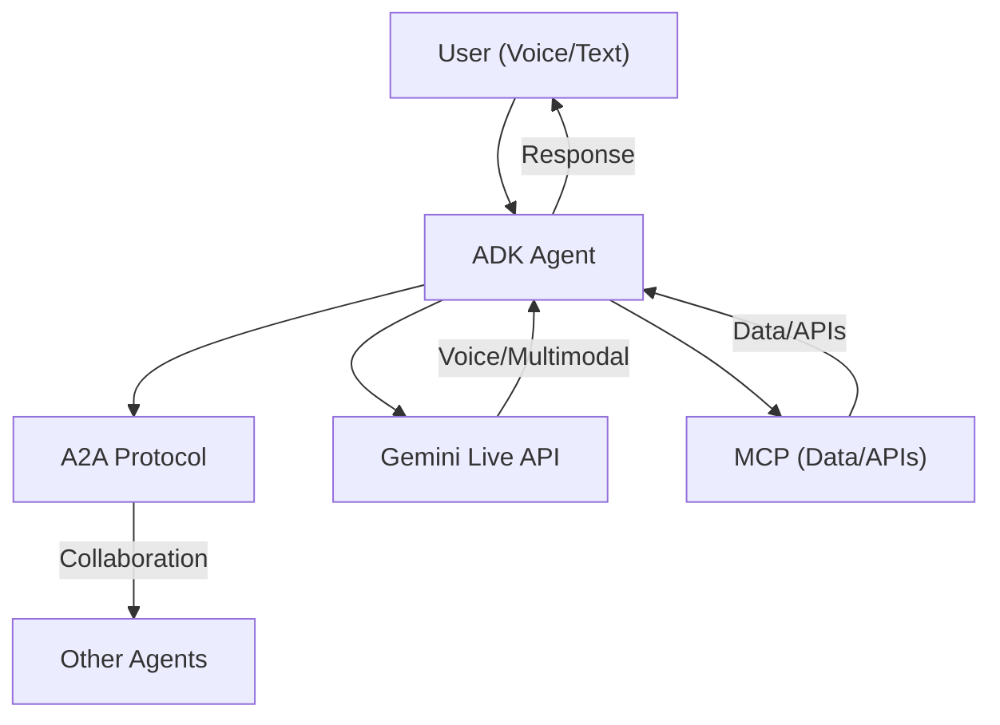

<!-- backgroundImage: "linear-gradient(to bottom,rgb(161, 0, 255),rgb(136, 0, 141))" -->
<!-- color: white -->
<!-- _class: lead -->

<!-- _speaker: Reminder, the _speaker element is used in order to define speaker notes. -->
<!-- _speaker: Good luck on the presentation champ -->

# IVR Development Stack: ADK, A2A, and Gemini Live
Presented By: Bear BlinSchauer

---

## Table of Contents

1. **Introduction & Executive Summary**
2. **Architecture Overview**
3. **Agent Development Kit (ADK)**
4. **Agent-to-Agent Protocol (A2A)**
5. **Gemini Live API**
6. **Model Context Protocol (MCP)**
7. **Putting It All Together: Demo Walkthrough**
8. **Deployment & Operations**
9. **Team Learning & Final Thoughts**

---

<!-- _class: lead -->
# Introduction

---

## What is Google's Agent Development Stack?

- A modern, modular platform for building intelligent, voice-driven customer experiences
- Combines Google's Agent Development Kit (ADK), Agent-to-Agent (A2A) protocol, MCP, and Gemini Live API
- Software-driven method enabling seamless, real-time collaboration between AI agents and users via voice and text

---

## Why Does This Matter?

- **Faster, smarter customer service:** Automate and enhance IVR (Interactive Voice Response) systems with advanced AI
- **Interoperability:** Open standards (A2A/MCP) allow agents from different vendors and platforms to work together
- **Real-time, multimodal:** Gemini Live enables natural, low-latency voice and text interactions
- **SWE Approach:** Higher flexibility and design control, faster iteration

---

## What Will You Learn Today?

- The core technologies powering next-generation IVR systems
- How ADK, A2A, MCP, and Gemini Live work together in a unified stack
- Key concepts, architecture, and practical implementation tips
- A live demo and actionable steps to get started

---

## Key Takeaways

- The ADK IVR stack is flexible, extensible, and ready for real-world deployment
- Open standards and Google's AI tools make it easy to build, scale, and integrate
- You'll leave with a clear understanding of the stack and how to start building with it

<!-- _class: lead -->
---

# Architecture Overview

---

## Google's Agentic AI IVR Stack

- **ADK:** Builds the agents, like a customer service bot
- **A2A:** Enables teamwork, allowing the bot to escalate issues to a billing agent built on a different platform
- **Gemini Live:** Acts as a layer to convert human speech into usable AI tokens in real time
- **MCP:** Connects agents to data and external APIs
- **LLMs:** Any models can work with ADK. Gemini models are better equipped for tool use (according to Google)
- **CI/CD:** Cloud Build & Agent Orchestration will be needed to roll out the project once built

---

## How This All Works Together

---
<!-- header: '[&#9671; ADK](#1 " ")' -->
<!-- _class: lead -->

# Agent Development Kit (ADK)
*Google's Toolkit for Building AI Assistants*

---

**Documentation:**
- https://google.github.io/adk-docs/
- https://github.com/google/adk-samples

ADK examples can be found in the Agent Garden in GCP.

---

## About ADK

ADK (App Development Kit) is an agentic chatbot framework made by Google. ADK consists of an SDK which helps developers design and deploy AI Agents. Currently ADK is best supported in Python, with Java bindings also available.

**ADK is:**
- Model Agnostic
- Deployment Agnostic  
- Interoperable with other technology

---

## What ADK Can Do

ADK is a technology which can be used to configure agents in a software engineering-oriented fashion. ADK allows the creation of agentic AI-driven agents with the ability to be integrated into systems such as IVR. ADK offers teams high flexibility in building new AI agents.

---
## ADK SDK

- ADK provides developers with a rich SDK with well-documented APIs
- During development, a simple web UI is provided for testing agents
- Comprehensive documentation and examples available online

---

## ADK Compared to Dialogflow Playbooks

ADK works in a very similar manner to Dialogflow agents but there are some key differences:

- An ADK agent powered by an LLM is analogous to a playbook
- Developers handle additional routing on their own with Python
- Compared to playbooks, ADK does not have examples capabilities - developers need to introduce few-shot prompting instead
- ADK does not handle NLU intent detection

---

## Recent Innovations

With recent innovations, ADK is beginning to add support for live voice via the **Gemini Live API**.

In order to use arbitrary models along with Gemini, ADK utilizes the LiteLLM library.

Agents can act as powerful reasoning skill agents or deterministic routing agents depending on the context. Deterministic agents are called workflow agents.

---

## ADK SDK

- ADK provides developers with a rich SDK with well-documented APIs
- During development, a simple web UI is provided for testing agents
- Comprehensive documentation and examples available online

---

## ADK Core Capabilities

- **Orchestration:** Works via LLM decisions by multi-agents during execution or by developer decisions. ADK uses sequential, loop, and parallel agent types to manage orchestration
- **Multiple subagents:** No A2A needed for internal coordination
- **Tools:** Work via Python functions. Agents read docstrings attached to Python functions to understand how to interface with them. Users have access to a tool ecosystem maintained by Google
- **Development:** Developers define core behavior and logic via agent prompts (similar to playbooks) and Python methods
- **Memory:** Manage agent lifecycles, state, and memory. ADK offers short-term session state memory and long-term knowledge options

---

## ADK Core Capabilities Cont.

- **Data Integration:** Integrate agents with data. ADK has built-in functions to deal with MCP
- **Safety:** Input and tool argument guardrails with `before_model_callback` and `before_tool_callback`
- **Deployment:** Integrated with Google CI (Agent Engine)
- **Testing:** ADK provides test framework for testing agents
- **Security:** Can sanitize user inputs via callbacks

---

## Key Concepts

- **Agent:** Worker unit for tasks
- **Tools:** Can be either Python functions or tools built into ADK by Google
  - AIs have the option to use Google Search without any extra setup
  - Documentation strings are essential for creating tools in ADK
- **Callbacks:** Functions called before or after agent, model interaction, or tool use
- **Session Management:** 
  - Context is the session
  - History is a log of chat events  
  - State represents agent's working memory
- **Events:** Basic units of data representing conversation flow

---

## Important Data Types, Classes and Functions

- **Callbacks:** Custom code snippets written into points in the agent's process for checks, logging, or behavior modifications
- **Grounding:** ADK agents can be "Grounded" by using Google Search as a tool
- **Memory:** Different from state. Allows agents to recall information across multiple sessions
  - **SessionService:** Manages conversation history and state for different users and sessions
  - **InMemorySessionService:** Simple implementation storing everything in memory
  - **Session State:** Tied to a specific user session, persists across conversational turns
- **Artifact Management:** Classes designed to allow agents to handle files or binary data
- **Runner:** Data class responsible for handling all execution flow
- **Agent Types:**
  - **LlmAgent:** Most essential class for quickly creating agents
  - **Sequential Agent:** Executes sub-agents in order
  - **Loop Agent:** Runs sequential agents until a condition is met
  - **Parallel Agent:** Runs agents asynchronously
  - **Custom Agents:** Inherit from BaseAgent for complex state management

---

### Important Data Types, Classes and Functions
- Callbacks: custom code snippets written into points in the agents process allowing for checks, logging or behavior modifications. set the callback in agent initialization, -> before_model_callback=block_keyword_guardrail
- Grounding: ADK agents can be "Grounded" by using google search as a tool. 
- Memory: Memory is different from state. Allows agents to recall information across multiple sessions.
    - SessionService: Responsible for managing conversation history and state for different users and sessions. 
    - The InMemorySessionService is a simple implementation that stores everything in memory, suitable for testing and simple applications. It keeps track of the messages exchanged. 
    - Session state: Tied to a specific user session. Persists information across multiple conversational turns within that session. 
    - Agents are able to insert data into the session state with the output key parameter. Agents have access to elements of the session state by putting the state data name in curly brackets.
- Artifact managment: There are classes desinged to allow agents to handle files or binary data.
    - ToolContext: Provides the context for a tool invocation, provides access to the invocation context, function call ID, event actions, and authentication response. Provides memory retrieval methods and methods for listing artifacts.
- Runner: This data class is responsible for handling all execution flow, orchestrates agent interactions based on events and coordinates with backend services. 
- Agent: Agent class is a label for the llm class. There are llm agents and workflow agents.
    - LlmAgent: This class is the most essential class for quickly creating agents. Every ADK package should have a root_agent object exposed for the ADK SDK and front end tools to use. 
    - Sequential Agent: Agent class which will execute sub agents in order. Useful for determenistic steps where tasks need to be completed in order. 
    - Loop Agent: This is a specialized agent class which runs sequential agents until a specific condition is met. 
    - Parallel Agent: Runs agents asyncronously. If the output of agent work is data, a merger agent might be necessary.
    - Custom Agents: ADK allows users to inherit from the BaseAgent class in order to create agents with more complex state managment or determenistic flows. 
        Overriding the _run_async_impl method is the primary way of defining behavior on agent invocation.
        The heart of any custom agent is the _run_async_impl method. This is where you define its unique behavior.
    - Driving classes: You can create a class whith a has a relationship with many agents and handles orchestration.       
        Making custom classes or inheriting BaseAgent is very useful to handle complex things like A2A interaction. 

---

## Agent Deployment

Deploying to cloud is essential for building agents. Google offers many different options - Vertex AI comes with an SDK to help with CI/CD configurations.

Agents are accessible through a specialized Agent Engine UI: https://google.github.io/adk-docs/deploy/agent-engine/

---

<!-- header: '[&#9671; A2A](#1 " ")' -->
# Agent-to-Agent Protocol (A2A)
*The Universal Language for AI Collaboration*

---

**Documentation:**
- https://github.com/a2aproject/A2A/blob/main/docs/tutorials/python/1-introduction.md
- https://github.com/a2aproject/a2a-samples

---

## About A2A

While originally owned by Google, ownership of the A2A protocol has moved to the Linux Foundation, which is committed to keeping this technology open source.

A2A is an open standard, common language for AI agent communication and collaboration.

**A2A works with tools such as:**
- Google ADK
- LangGraph
- CrewAI
- Genkit

---

## A2A High-Level Use Cases

At a high level, A2A is used to:
- Offer direct, standardized communication and collaboration between different AI agents, even if they are running as separate services or on different machines
- Enable agents to discover each other's capabilities (via Agent Cards) and delegate tasks
- Form a network of collaborating asynchronous AI agents

---

## A2A Key Facts

**From the blog:**
- A2A is built on existing standards (HTTP, SSE, JSON-RPC)
- Complements the MCP protocol which is made by Anthropic
- Very new technology, may face issues on the bleeding edge
- Google has partnered with over 50 businesses, including Accenture
- *Someone from accenture, Scott Alfieri is specifically quoted in the announcement blog. He is an AGBG global lead*

---

## A2A Facilitates Interaction Between 3 Key Parties

- **End User:** A human
- **Client Agent:** Responsible for creating requests and handling end user actions
  - Fetch and understand agent cards
  - Send messages
  - Process responses
  - Handle & manage Task IDs for tasks which take time and ping for task completion
- **Remote Agent:** Responsible for acting on requests made, taking correct action
  - Host agent cards with skills and capability info
  - Handle incoming agent requests and execute them via agentExecutor

---

## Main Capabilities of A2A

1. **Agent Discovery:**
   - Agents advertise capabilities using "Agent Cards" in JSON format
   - Agent cards act like robots.txt to help classify and index agents
   - Clients know when and how to utilize agents

2. **UX Negotiation:**
   - Clients and agents agree on communication methods
   - Negotiate proper format and user interface capabilities

3. **Task Management:**
   - Communicate task status, changes, and dependencies throughout execution
   - "Task" object has a defined lifecycle

4. **Collaboration:**
   - Agents send messages to each other to convey context, responses, artifacts, or user instructions
   - Dynamic interactions
   - Agents request clarifications from end users

---

## A2A Agent Interaction Pipeline

**End-User → Client → Client Agent → Agent Mesh**

**Interaction Timeline:**
1. **Agent Discovery:** Client Agent searches remote agent to find capabilities through agent.json file
2. **Interactions:** Bots send JSON-RPC messages to each other over HTTPS containing A2A Objects:
   - **Messages:** One turn in the operation
     - Roles (user/agent)
     - Parts (text, file, or JSON)
   - **Agent Executor:** Links protocol plumbing to agent logic
   - **Task Objects:** Contains ID and status
     - Client agent can call tasks get function to query task completion status
     - Eventually returns task as completed with summary in task.artifacts
3. **Streaming:** Server agent can push updates to a task as they happen instead of polling

---

## Important Classes, Data Types, and Functions

**Agent Skills:** (Can be created as Python classes)
- Id: skill identifier
- Name: human readable name
- Description: Detailed explanation of what the skill does
- Tags: keywords for categorization & discovery
- Examples: Sample use cases & prompts
- I/O Modes: Supported media for I/O (text, JSON, etc.)

---

## Agent Card

JSON document which A2A server makes publicly available, usually stored at `.well-known/agent.json` (analogous to robots.txt or business card).

**Agent cards are crucial for creating an agent network:**
- Name, Description, Version: Basic identity info
- URL: Endpoint where the A2A service can be reached
- Capabilities: Specified supported A2A features (streaming, push notifications, etc.)
- Default I/O modes: Default media types for agent
- Skills: List of the AgentSkill objects outlined earlier

---

## Agent Executor

Core logic of how A2A agents process requests & generate responses. The A2A SDK provides the abstract class `a2a.server.agent_execution.AgentExecutor` to implement.

Links the A2A protocol plumbing together (A2A SDK & logic of our agent). SDK handles HTTP, JSON-RPC & event management.

**The AgentExecutor class has two main methods:**
- `Execute(self, context: RequestContext, event_queue: EventQueue)`: Handles requests which expect a response or event stream
- `Cancel(self, context: RequestContext, event_queue: EventQueue)`: Handles requests to cancel running tasks

Event queues are objects which queue up data to be sent.

---

## Task Object

Job which an agent needs to do. Has an ID and a status for progress tracking.

An agent can periodically call tasks get in order to get the task status of another agent.

A completed task will contain a summary in a file named `task.artifacts`.

---

## Serving A2A Content

**A2AStarletteApplication:** Class to simplify getting an A2A-compliant HTTP server running. Uses Starlette for the web server and runs with Uvicorn.

**DefaultRequestHandler:** Takes AgentExecutor and TaskStore, applies appropriate routing for new A2A RPC calls.

**TaskStore:** Manages lifecycle of tasks, useful for stateful interactions, streaming, and resubscription.

**Uvicorn.run(Server_builder.build()):** A2AStarletteApplication has a build method to construct the application, then run using uvicorn.run for HTTP access.

---

## Additional Tools in A2A SDK

**A2A Python Library (a2a-python):**
- Concrete library used to make ADK agents speak the A2A protocol
- Provides server-side components needed to:
  - Expose agents as A2A-compliant servers
  - Automatically handle serving the "Agent Card" for discovery
  - Receive and manage incoming task requests from other agents

**A2A Inspector:**
- Web-based debugging tool to connect to, inspect, and interact with A2A-enabled agents
- Essential part of development workflow
- Provides:
  - Agent Card Viewer: Fetch and validate agent's public capabilities
  - Live Chat Interface: Send messages directly to deployed agents
  - Debug Console: View raw JSON-RPC messages being exchanged

---

<!-- header: '[&#9671; Gemini](#1 " ")' -->
# Gemini Live API
*Low latency, two-way voice interactions*

---

## About Gemini Live API

**Gemini Live offers:**
- Real-time multimodal understanding (video and audio)
- Integration with tools such as function calling and grounding with Google Search
- Low latency → almost human-like interactions
- Multilingual support
- With native audio: Gemini can understand the user's tone of voice
- Context awareness, disregards ambient conversations

---

## Audio Requirements

**Audio must be in these formats:**
- **Input audio:** Raw 16-bit PCM audio at 16kHz, little-endian
- **Output audio:** Raw 16-bit PCM audio at 24kHz, little-endian

ADK natively supports using Gemini Live, but you need to use a Gemini model which supports the Live API.

See https://cloud.google.com/vertex-ai/generative-ai/docs/live-api for a list of model options.

Right now the Gemini Live API is only supported with the `gemini-live-2.5-flash` models.

---

## Using the API

**Implementation options:**
- **Server-to-server:** Backend connects to the Live API using WebSockets. Clients send streams of data to your server which then forwards it to the API
- **Client-to-server:** Frontend code connects directly to Google's servers using WebSockets to stream data
- Client-to-server is more performant and easier to set up

**Documentation:** https://ai.google.dev/gemini-api/docs/live-guide

---

<!-- header: '[&#9671; MCP](#1 " ")' -->
# Model Context Protocol (MCP)

---

## About MCP

The Model Context Protocol (MCP) is an open standard for connecting AI applications to external data sources and tools.

**Key features:**
- Enables agents to access external data sources
- Provides standardized way to connect to databases, APIs, and other services
- Complements A2A for comprehensive agent capabilities
- Developed by Anthropic, now widely adopted

---

## MCP in the IVR Stack

- **Data Integration:** Connects agents to order histories, inventory, customer databases
- **API Access:** Enables agents to interact with external services
- **Standardization:** Provides consistent interface for data access across different sources
- **Security:** Handles authentication and authorization for data access

---

<!-- header: '[&#9671; Demo](#1 " ")' -->
# Putting It All Together: Demo Walkthrough

---

## Demo Overview

In this demo, we'll show how all components work together:

1. **User Interaction:** Voice/text input via Gemini Live
2. **ADK Processing:** Agent handles the request using tools and memory
3. **A2A Collaboration:** Agent delegates to specialized agents if needed
<!-- 4. **MCP Integration:** Agent accesses external data as required -->
5. **Response:** Agent responds via voice/text output

---

## Demo Components

- **Voice Input:** Real-time speech-to-text via Gemini Live
- **Agent Processing:** ADK agent with tools and memory
- **Agent Collaboration:** A2A protocol for multi-agent workflows
<!-- - **Data Access:** MCP for external data sources -->
- **Voice Output:** Text-to-speech response

---

<!-- header: '[&#9671; Deploy](#1 " ")' -->
# Deployment & Operations

---

## Deployment Options

**Google Cloud Platform:**
- Vertex AI Agent Engine
- Cloud Run for containerized deployments
- Cloud Functions for serverless options

**On-Premises:**
- Docker containers
- Kubernetes orchestration
- Custom infrastructure

---

## CI/CD Pipeline

**Recommended Setup:**
- **Source Control:** Git with feature branches
- **Build:** Cloud Build or GitHub Actions
- **Testing:** ADK test framework
- **Deployment:** Automated deployment to staging/production
- **Monitoring:** Cloud Monitoring and logging

---

## Operational Considerations

- **Scaling:** Horizontal scaling for high-traffic scenarios
- **Monitoring:** Real-time monitoring of agent performance
- **Security:** Input validation, authentication, and authorization
- **Backup:** Regular backups of agent configurations and data
- **Updates:** Zero-downtime deployment strategies

---
<!-- _class: lead -->
<!-- header: '[&#9671; Setting Up](#1 " ")' -->

# Team Learning

---

## Required Skills

In order to adopt an ADK system, team members will need to adopt key skills and adapt to a software-driven workflow:

- **Git:** Version control basics and best practices
- **Python:** Minimal knowledge required to write agent prompts
  - Python basics: variables, math, dictionaries, etc.
  - Python classes (OOP design)
  - Asynchronous Python
- **JSON:** Needed to write agent cards
- **Web:** Understanding API basics and WebSockets for streaming (Gemini Live/A2A)

---

## Development Environment Setup

**Prerequisites:**
- Python 3.8+
- Google Cloud SDK
- Git
- IDE (VS Code recommended)

**Setup Steps:**
1. Clone the repository
2. Install dependencies: `pip install -r requirements.txt`
3. Set up Google Cloud credentials
4. Configure environment variables
5. Run local development server

---

## Learning Path

**For Prompt Developers:**
- Elementary Python (variables, math, print, logging, etc.)
- Basics of functions and docstrings
- Python dictionaries (similar to JSON objects)
- Python module interaction

**For Agent Orchestration Developers:**
- Asynchronous functions & asyncio
- Python classes and OOP concepts
- Intermediate classes knowledge, inheritance, factory methods

---
<!-- _class: lead -->
<!-- header: '[&#9671; End](#1 " ")' -->

# Final Thoughts

---

## Key Reflections

As we've explored today, Google's Agent Development Stack—comprising ADK, A2A, MCP, and the Gemini Live API—represents a powerful shift in how we build, deploy, and scale intelligent agents.

**Key insights:**
- **Modular by Design:** Each component is purpose-built but interoperable, enabling flexible, scalable agent architectures
- **Open Standards:** Protocols like A2A and MCP are paving the way for cross-platform, multi-agent collaboration
- **Voice-First:** Gemini Live and ADK bring real-time, multimodal interaction to the forefront of customer experience
- **Developer-Centric:** With Python-first SDKs, callback hooks, and CI/CD support, this stack empowers engineers to build with precision and control

---

## Next Steps

**Getting Started:**
1. Set up development environment
2. Create your first ADK agent
3. Integrate with A2A for multi-agent workflows
4. Add Gemini Live for voice capabilities
5. Deploy to production

**Resources:**
- Official documentation links provided throughout
- GitHub repositories for examples
- Community forums and support channels

---

# Thank You

Let's continue exploring, building, and learning together.

**Questions? Ideas? Let's talk.**

---

- Python and software development basics: (Minimal python knowledge is required in order to write agent prompts.)
- Command line basics (to set up adk testing servers)
- Google cloud console and ADK deployment.
- Basic JSON knowledge (to write agent cards.)
- Documentation understanding
- Understanding of web for A2A servers.
- Understanding of websocket and live audio streaming for gemini live implementations.

# Extra Notes
*Space for additional notes, references, and follow-up items*

**Study guide for ADK & A2A python**
*Prompt developer*
- Elementary python (Variables, math, print logging, etc.)
- Basics of functions
- Docstrings
- Basics of python dictionaries. (dictionaries are very similar to JSON objects.)
- Python module interaction
*Agent Orchestration developer*
- Asyncronous functions & Asyncio
- Basics of python classes. (Classes are templates for objects, objects are groupings of function and variable data.)
- Intermediate classes knowledge, inheritance, writing classes, factory methods.

